# docflow — Guide utilisateur

docflow est une application auto-hébergée de documentation structurée. Elle combine un
wiki (pages markdown organisées en arbre) et des données typées que **vous** définissez :
vos propres types de documents (épic, fonctionnalité, article, runbook…), leurs propriétés
(statut, estimation, échéance…) et leur hiérarchie. Rien n'est câblé en dur.

Ce guide suit un exemple concret de bout en bout : une équipe produit qui gère sa
**roadmap** (épics → fonctionnalités avec statut) et son **wiki** (pages d'installation
et d'architecture) dans un même espace de travail.

> Compléments : [ONBOARDING.md](ONBOARDING.md) (premiers pas, version texte détaillée) et
> [FONCTIONNALITES.md](FONCTIONNALITES.md) (référence exhaustive des fonctionnalités).

---

## 1. Premier démarrage

À la première ouverture de l'application, il n'y a aucun compte : docflow vous demande de
créer le compte administrateur.

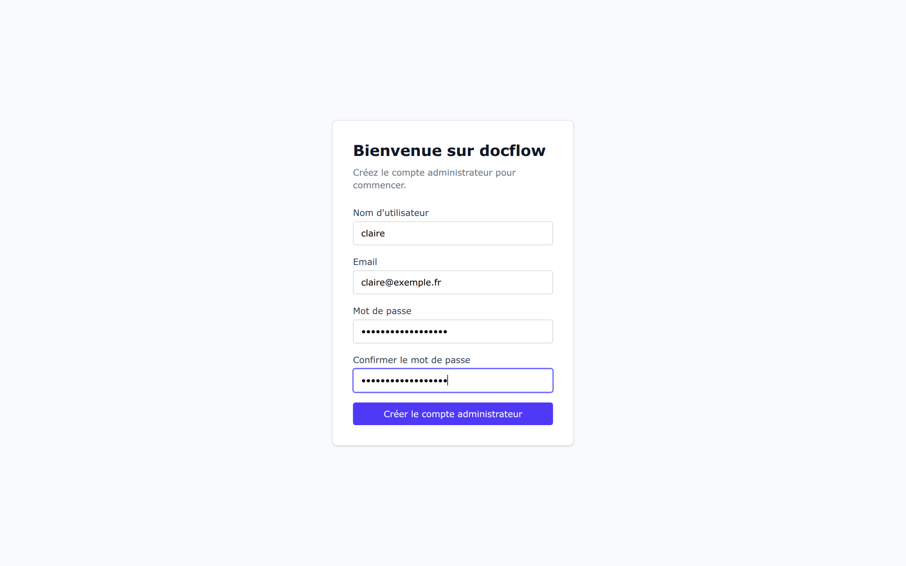

Remplissez les quatre champs et cliquez **Créer le compte administrateur**. Retenez bien
ce mot de passe : ce compte local est le **compte de secours**. Même si vous branchez plus
tard une authentification d'entreprise (SSO Keycloak) et qu'elle tombe en panne, ce compte
continue de fonctionner — l'application refuse d'ailleurs de désactiver ou supprimer le
dernier administrateur local.

## 2. Se connecter

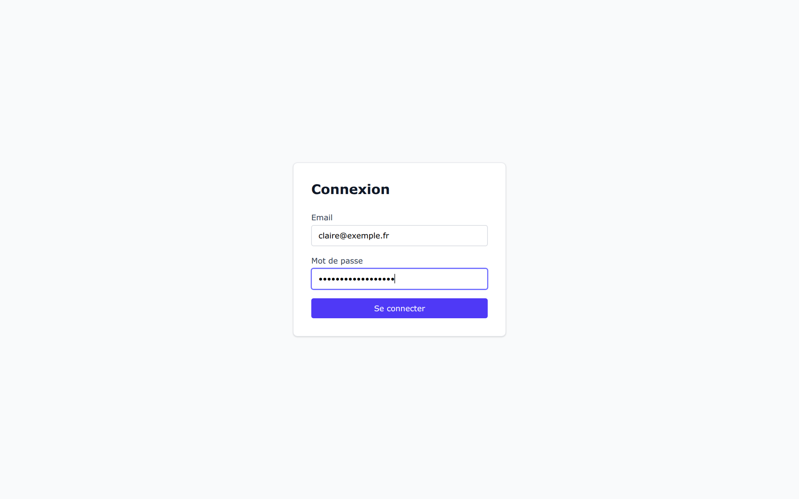

Email + mot de passe. Si votre administrateur a configuré le SSO (OIDC), un bouton de
connexion d'entreprise apparaît en plus. Dans ce cas, votre compte est créé automatiquement
à la première connexion SSO, mais un administrateur doit le **valider** (menu
Administration → Utilisateurs) avant que vous n'accédiez au contenu.

## 3. Les workspaces

Un **workspace** est un espace complètement cloisonné : ses documents, ses types et ses
statuts n'existent que pour lui. Créez-en un par produit, par équipe ou par client.

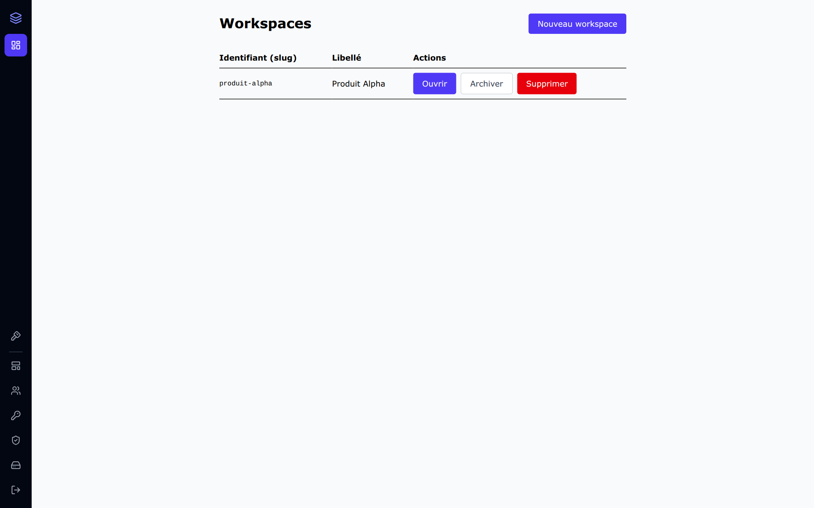

Cliquez **Nouveau workspace**, donnez un identifiant (le *slug*, en minuscules sans espaces
— il est définitif) et un libellé. **Archiver** passe un workspace en lecture seule sans
rien supprimer ; **Supprimer** efface tout son contenu.

## 4. Définir les types et les statuts

Avant de créer des documents, dites à docflow **de quoi** votre workspace est fait. Dans
notre exemple : un type `epic`, un type `feature` enfant d'`epic` (une fonctionnalité vit
toujours sous un épic), et un type `page` pour le wiki.

Menu latéral → **Types** :

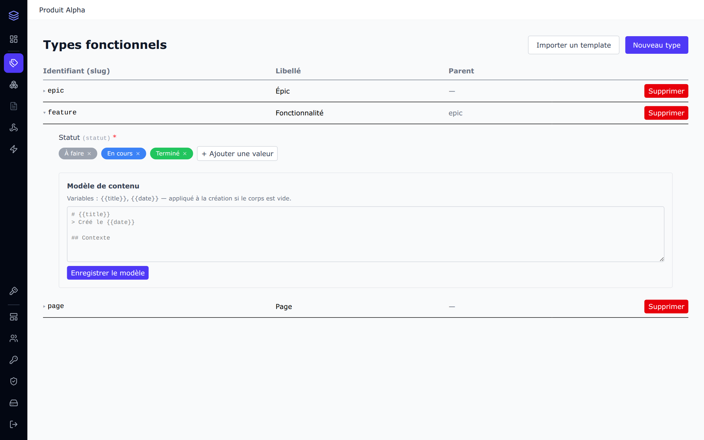

Concrètement :

- **Nouveau type** : slug + libellé + parent éventuel. Le parent définit la hiérarchie
  autorisée dans l'arbre des documents (un `feature` ne peut être créé que sous un `epic`).
- Cliquez sur une ligne pour la déplier et gérer ses **propriétés**. Une propriété a un
  type de valeur : texte, entier, décimal, date, booléen, URL, référence vers un autre
  document, ou **liste restreinte**.
- Un **statut**, c'est simplement une propriété « liste restreinte » : ici `Statut` avec
  les valeurs *À faire* / *En cours* / *Terminé*, chacune avec sa couleur et son ordre.
  Cochez « requis » (l'astérisque rouge) pour qu'aucun document ne puisse exister sans statut.
- Le **modèle de contenu** pré-remplit le corps markdown des nouveaux documents de ce type
  (variables `{{title}}` et `{{date}}`).

Pas envie de tout définir à la main ? **Importer un template** installe un jeu de types
prêt à l'emploi (voir §9).

## 5. Les blocs

Un **bloc** est un conteneur de documents à l'intérieur du workspace, avec un **type
racine** : les documents à la racine du bloc sont forcément de ce type. Notre exemple a
deux blocs : `roadmap` (racine `epic`) et `wiki` (racine `page`).

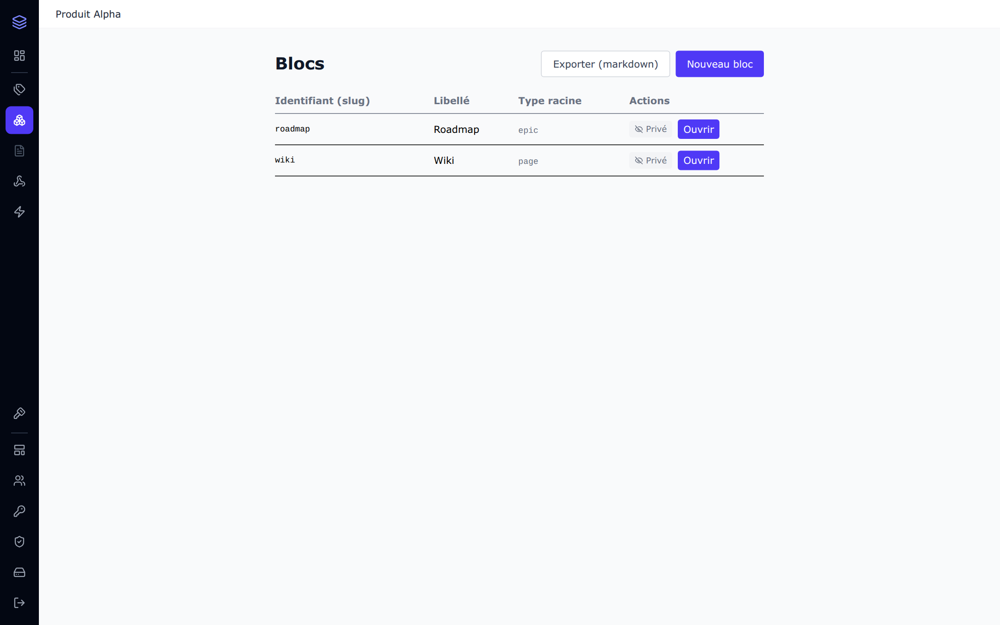

Le bouton **Privé/Public** contrôle l'exposition publique (voir §8), **Exporter (markdown)**
télécharge une archive de tout le contenu.

## 6. Organiser les documents

Ouvrez un bloc : les documents s'affichent en arbre, avec les propriétés en colonnes.

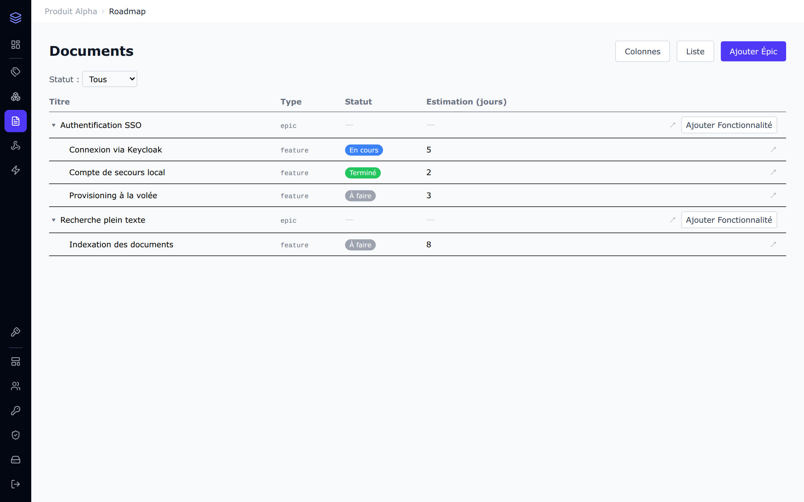

Ce qu'on voit ici : deux épics, leurs fonctionnalités enfants, la colonne **Statut**
(pastilles colorées définies au §4) et la colonne **Estimation**. En pratique :

- **Ajouter Épic** crée un document racine ; le bouton **Ajouter Fonctionnalité** sur la
  ligne d'un épic crée un enfant — les types proposés respectent la hiérarchie définie.
- Le filtre **Statut** au-dessus de la table ne montre que les documents dans l'état choisi.
- **Colonnes** choisit les propriétés affichées ; **Liste** bascule en vue à plat.
- La flèche en bout de ligne ouvre le document.

## 7. Rédiger un document

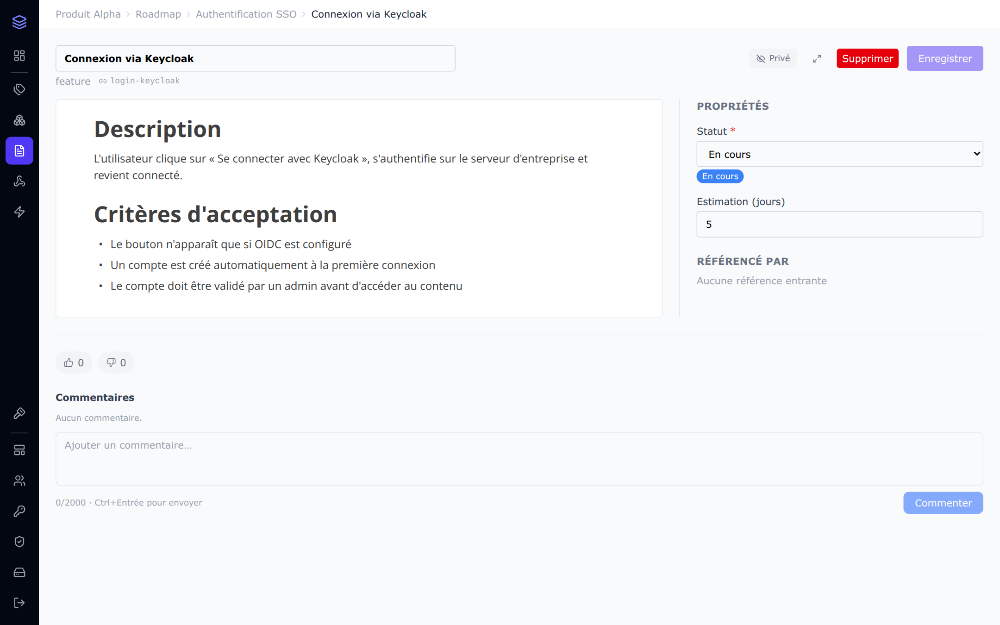

L'éditeur fonctionne comme Notion : tapez votre texte, ou `/` pour insérer un élément
(titre, liste, tableau, bloc de code, diagramme mermaid, image, lien vers un document…).
C'est du **markdown** : `# titre`, `- liste`, etc. fonctionnent directement.

À droite, le panneau **Propriétés** porte les valeurs du document : ici le statut
*En cours* (menu déroulant) et l'estimation. Une propriété marquée `*` est obligatoire.
**Référencé par** liste les documents qui pointent vers celui-ci (liens entrants).

Points importants :

- **Enregistrer** crée une nouvelle version. Si quelqu'un a modifié le document entre
  temps, docflow le détecte et vous montre la version en conflit au lieu d'écraser.
- Les **commentaires** (avec 👍/👎) sont sous le document.
- **Supprimer** supprime aussi tous les documents enfants.

### Insérer une image

Copiez-collez une image directement dans l'éditeur (`Ctrl+V`), ou glissez-déposez un
fichier, ou tapez `/image`. L'image est stockée **dans docflow** (pas de dépendance à un
service externe) :

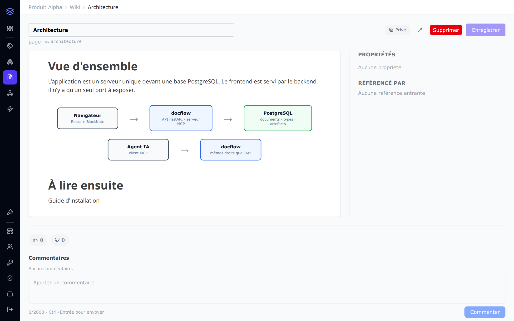

Ce qu'il faut savoir :

- Formats acceptés : PNG, JPG, GIF, WebP, SVG — 10 Mo max par image (configurable).
- La même image collée deux fois n'est stockée **qu'une seule fois** (déduplication par
  empreinte du contenu).
- Une image n'est **supprimée automatiquement** que lorsque plus aucun document ne
  l'utilise. Tant qu'une autre page la référence, supprimer une page ne la casse pas.

### Lier des documents entre eux

Tapez `/` puis **Lien document**, cherchez par titre, sélectionnez : un lien est inséré.
Le document cible affichera ce lien dans son panneau « Référencé par ». Si la cible est
supprimée, le lien apparaît dans le suivi des **liens cassés** du workspace.

## 8. Publier une page

Chaque document a un bouton **Privé/Public** (en haut à droite de l'éditeur). Passer un
document en public l'expose **en lecture seule, sans compte**, à l'adresse
`http://votre-serveur/pub/<id-du-document>` — l'exposition s'applique aussi à ses enfants.

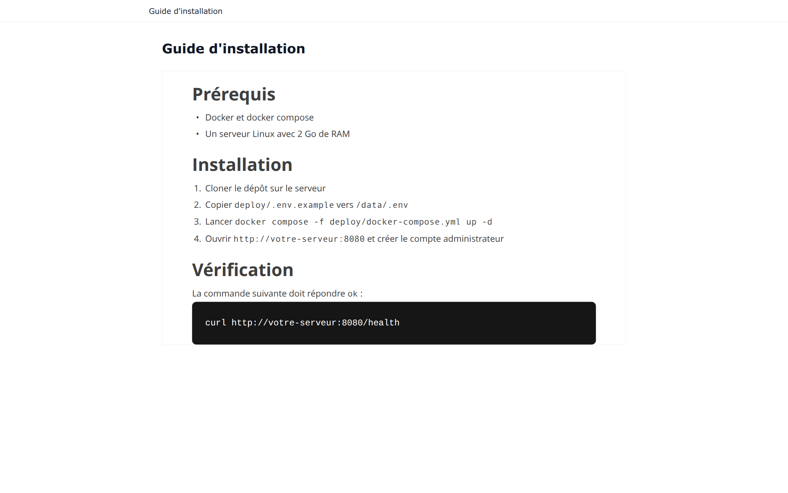

Les images contenues dans une page publique sont servies aussi ; le reste du workspace
reste privé. Repasser le document en privé coupe l'accès immédiatement.

## 9. Les templates

Menu **Templates** : des jeux de types prêts à l'emploi, à importer dans un workspace en
un clic.

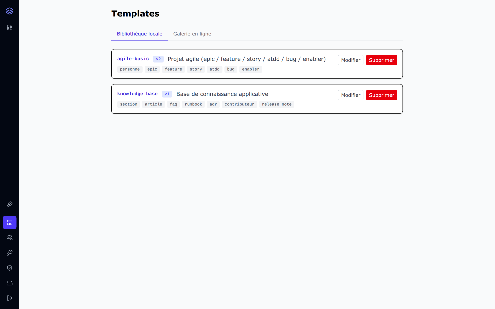

- **Bibliothèque locale** : les templates présents sur le serveur (fichiers `.yaml` du
  dossier `templates/`, modifiables depuis l'interface). Exemple fourni : `agile-basic`
  (épics / features / stories / bugs avec statuts) et `knowledge-base` (sections, articles,
  FAQ, runbooks, ADR).
- **Galerie en ligne** : des sources distantes configurables — vous voyez ce qui est
  installé, ce qui a une mise à jour, et vous tirez un template chez vous en un clic.
- L'import dans un workspace se fait depuis la page **Types** → « Importer un template ».
  L'import est **additif** : il ne supprime jamais vos types existants, et vous prévient
  en cas de conflit de version.

## 10. Connecter un agent IA (MCP)

docflow embarque un **serveur MCP** : un assistant IA (Claude Desktop, Cursor…) peut lire
et écrire vos documents avec exactement les mêmes règles de droits que vous.

Menu **Clés API** :

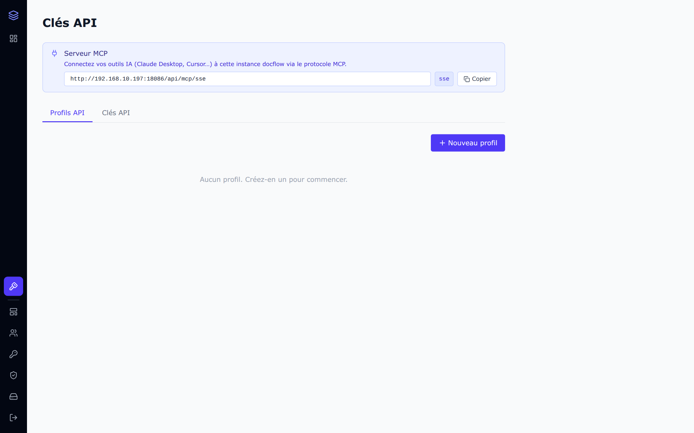

Marche à suivre, dans l'ordre :

1. **Nouveau profil** : nommez-le (ex. « assistant-produit ») et donnez-lui un périmètre —
   quels workspaces, quels blocs, lecture seule ou écriture. Un profil « admin » donne
   tout ; évitez-le pour un agent.
2. Onglet **Clés API** → générer une clé pour ce profil. La clé (`dfk_…`) n'est affichée
   **qu'une seule fois** : copiez-la immédiatement.
3. Dans votre outil IA, déclarez un serveur MCP avec l'URL affichée en haut de la page
   (`http://votre-serveur/api/mcp/sse`) et la clé en Bearer token.

L'agent dispose alors d'outils pour lister les workspaces, lire/créer/modifier des
documents, poser des valeurs de propriétés, pousser des images dans une page et obtenir
des liens de téléchargement — toujours dans les limites du profil de la clé. Révoquez la
clé à tout moment depuis le même écran.

## 11. Sauvegardes

Menu **Connexions & Sauvegarde** (réservé aux administrateurs), trois onglets :

- **Certificats** : clés SSH / certificats TLS réutilisables par les connexions.
- **Remote Points** : les destinations distantes (dépôt git, SFTP, FTP/FTPS), avec un
  bouton **Tester la connexion** pour vérifier hôte + authentification avant usage.
- **Sauvegarde** : les jobs planifiés.

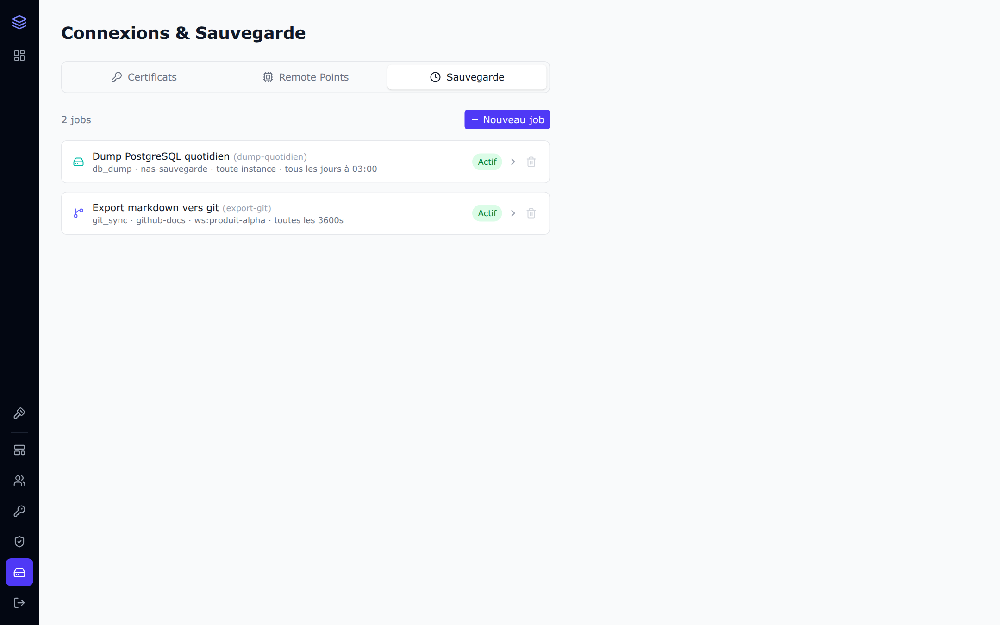

Deux stratégies, complémentaires :

- **db_dump** : dump PostgreSQL complet de l'instance, déposé sur le point distant —
  c'est la sauvegarde de restauration. Planification par heure fixe (ex. tous les jours
  à 03:00) ou par intervalle.
- **git_sync** : exporte le contenu d'un workspace en fichiers markdown et le pousse dans
  un dépôt git — lisible, diffable, hors de docflow. Idéal pour garder une copie humaine
  de la documentation.

Chaque job garde l'historique de ses 15 dernières exécutions (statut, erreurs, commit).

## 12. Administration courante

- **Utilisateurs** : valider les comptes arrivés par SSO, désactiver un compte. Garde-fou :
  le dernier admin local connectable ne peut être ni désactivé ni supprimé.
- **OIDC** : brancher Keycloak (issuer, client, secret) — le secret peut être une référence
  vault, il n'est jamais stocké en clair.
- **Coffre (vault)** : wallets Harpocrate et secrets chiffrés utilisés par les webhooks,
  automates et connexions.
- **Webhooks / Automates** (par workspace) : notifier un système externe ou déclencher un
  appel HTTP à la création/modification de documents.
